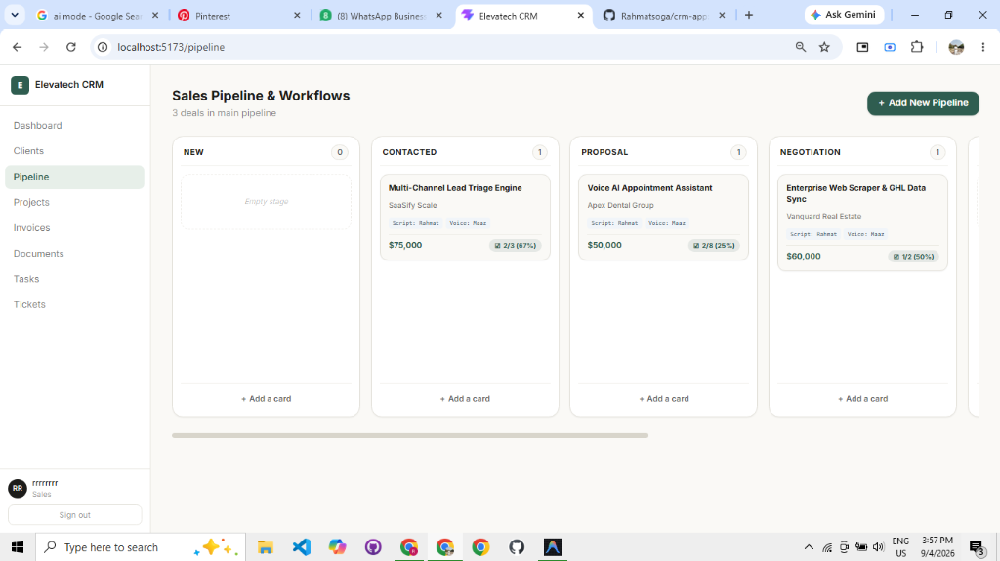
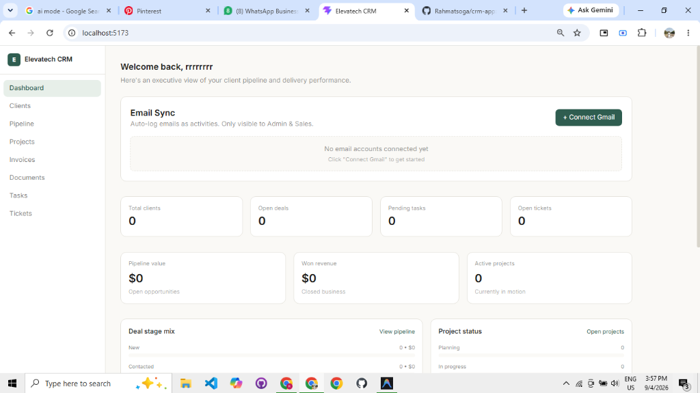

# Elevatech CRM — Enterprise Software House CRM & Video Production Engine

A production-ready, role-based Customer Relationship Management (CRM) system built specifically for software houses and video production agencies. Integrates **Trello-style Workflow Boards**, **Twilio Omnichannel Engine (SMS, WhatsApp, VoIP WebRTC Calling, Stage Automations)**, **Client Management**, **Project Tracking**, **Invoicing**, **Documents**, **Task Management**, and **Row Level Security (RLS)**.

---

## 📊 System Feature Matrix

| Feature Module | Functionality Description | Integration / Tech | Status |
| :--- | :--- | :--- | :---: |
| 💬 **Twilio VoIP Dialer** | In-browser WebRTC click-to-call with call timer, live notes recorder, and database logging | Twilio Voice WebRTC API | ✅ Production Ready |
| 📱 **Twilio SMS & WhatsApp** | Send instant SMS & WhatsApp messages inside Deal Cards & Tasks with predefined templates | Twilio REST API | ✅ Production Ready |
| ⚡ **Automated Stage Workflows** | Auto-dispatches SMS/WhatsApp notifications on deal stage transitions (e.g. *Proposal*, *Won*) | Twilio Trigger Engine | ✅ Production Ready |
| 📋 **Trello Workflow Board** | Custom columns, deal cards, responsibilities tagging (*Script*, *Voice*, *Editing*, *Thumbnail*) | React 19 + Tailwind | ✅ Production Ready |
| ☑️ **8-Step Production Checklist**| Progress tracking bar (0-100%) with dynamic checklist items & responsibility leads | Supabase Database | ✅ Production Ready |
| 📜 **Unified Activity Feed** | Chronological activity timeline merging CRM interactions & Twilio Communication Logs | Supabase Realtime | ✅ Production Ready |
| 🔒 **Role-Based Security** | Row Level Security (RLS) policies enforcing database-level data isolation | PostgreSQL RLS | ✅ Production Ready |

---

## 📸 Application Screenshots

### 📋 Trello-Style Kanban Sales Pipeline Board


### 💬 Twilio Communication Center & WebRTC Call Dialer


---

## 💬 Twilio Integration Architecture

```
                               ┌────────────────────────────────┐
                               │   CRM Pipeline / Deal Cards    │
                               └───────────────┬────────────────┘
                                               │
                                 Trigger Event │ (Stage Move / SMS / Call)
                                               ▼
                               ┌────────────────────────────────┐
                               │     src/lib/twilioService.js   │
                               └───────────────┬────────────────┘
                                               │
                       ┌───────────────────────┴───────────────────────┐
                       ▼                                               ▼
       ┌───────────────────────────────┐               ┌───────────────────────────────┐
       │     Twilio REST / Voice API   │               │   Supabase PostgreSQL DB      │
       │   (SMS, WhatsApp, WebRTC)     │               │    `communication_logs`      │
       └───────────────┬───────────────┘               └───────────────┬───────────────┘
                       │                                               │
                       ▼                                               ▼
       ┌───────────────────────────────┐               ┌───────────────────────────────┐
       │     Client Mobile Device      │               │   Realtime Activity Timeline  │
       └───────────────────────────────┘               └───────────────────────────────┘
```

### Key Capabilities

1. **In-Modal Communication Center ([`src/components/PipelineCardModal.jsx`](file:///c:/Users/Rahmatullah/Downloads/crm-app/src/components/PipelineCardModal.jsx))**:
   - **VoIP Click-to-Call**: Direct dial button with real-time call timer (`00:45`), mute control, call notes, and direct CRM log storage.
   - **SMS & WhatsApp Sender**: Channel toggle, custom message composer, and pre-built templates (*Proposal Ready*, *Check-in Reminder*, *Project Welcome*).
   - **Communication History**: Live timeline displaying sent/received SMS, WhatsApp messages, and call durations.

2. **Automated Stage Workflows ([`src/pages/Pipeline.jsx`](file:///c:/Users/Rahmatullah/Downloads/crm-app/src/pages/Pipeline.jsx))**:
   - Moving a deal card to a stage (e.g. *Proposal Sent*, *Contacted*, *Closed Won*) automatically executes `triggerStageAutomation()`, sending SMS/WhatsApp messages to the client phone number.

3. **Task Communication Actions ([`src/pages/Tasks.jsx`](file:///c:/Users/Rahmatullah/Downloads/crm-app/src/pages/Tasks.jsx))**:
   - Inline "📱 SMS" quick-dispatch buttons for task follow-ups and automated completion notifications when tasks are checked `done`.

---

## 📋 Trello Workflow Board Design

The **Sales Pipeline & Workflows** page ([`src/pages/Pipeline.jsx`](file:///c:/Users/Rahmatullah/Downloads/crm-app/src/pages/Pipeline.jsx)) is styled identically to modern **Trello Boards**:

- **Custom List Columns**:
  - Columns can be renamed on-the-fly by clicking directly on the column title (e.g., `Video Editing: Ready to Review`, `Thumbnail: Needed`, `Published`).
  - Card counter badges on every list header.
- **Card Structure**:
  - Bold card title (e.g., `070 The Most Disturbing Sea Disasters Ever`).
  - Subtitle / Client company name.
  - **Responsibility Tags**: `Script: Rahmat`, `Voice: Maaz`.
  - **Checklist Progress Pill**: `☑ 2/8 (67%)`.
  - Deal Value tag.
- **Card Modal**:
  - Editable **Responsibilities & Team Leads** (Script, Voice Over, Video Editing, Thumbnail).
  - Dynamic **Workflow Checklist** (add, delete, check/uncheck items with real-time progress bar recalculation).

---

## 🗄️ Database Schema & SQL Scripts

### Twilio Communication Tables ([`database/create-twilio-tables.sql`](file:///c:/Users/Rahmatullah/Downloads/crm-app/database/create-twilio-tables.sql))

```sql
-- Communication Logs Table (SMS, WhatsApp, Voice Calls)
CREATE TABLE IF NOT EXISTS public.communication_logs (
  id UUID PRIMARY KEY DEFAULT gen_random_uuid(),
  tenant_id UUID,
  deal_id UUID REFERENCES public.deals(id) ON DELETE SET NULL,
  client_id UUID REFERENCES public.clients(id) ON DELETE SET NULL,
  card_id UUID REFERENCES public.pipeline_cards(id) ON DELETE SET NULL,
  channel VARCHAR(50) NOT NULL CHECK (channel IN ('sms', 'whatsapp', 'voice', 'email')),
  direction VARCHAR(20) NOT NULL CHECK (direction IN ('inbound', 'outbound')),
  sender_number VARCHAR(100),
  recipient_number VARCHAR(100) NOT NULL,
  message_body TEXT,
  call_duration_seconds INT DEFAULT 0,
  recording_url TEXT,
  status VARCHAR(50) DEFAULT 'sent' CHECK (status IN ('queued', 'sent', 'delivered', 'failed', 'completed', 'received')),
  twilio_sid VARCHAR(255),
  created_by UUID REFERENCES public.users(id) ON DELETE SET NULL,
  created_at TIMESTAMP WITH TIME ZONE DEFAULT NOW()
);

-- Pipeline Stage Automation Rules
CREATE TABLE IF NOT EXISTS public.pipeline_automation_rules (
  id UUID PRIMARY KEY DEFAULT gen_random_uuid(),
  stage_id UUID REFERENCES public.pipeline_stages(id) ON DELETE CASCADE,
  trigger_event VARCHAR(100) NOT NULL DEFAULT 'on_stage_entry',
  action_type VARCHAR(50) NOT NULL CHECK (action_type IN ('send_sms', 'send_whatsapp', 'create_task', 'log_call_prompt')),
  template_body TEXT NOT NULL,
  delay_minutes INT DEFAULT 0,
  is_active BOOLEAN DEFAULT TRUE,
  created_at TIMESTAMP WITH TIME ZONE DEFAULT NOW()
);
```

---

## 🚀 Quick Start Guide

### 1. Installation

```bash
git clone https://github.com/Rahmatsoga/crm-app.git
cd crm-app
npm install
```

### 2. Database Migration

Run the following SQL files in your Supabase SQL Editor:
1. `database/crm_supabase_schema.sql` (Core tables)
2. `database/create-pipeline-tables.sql` (Custom pipeline tables)
3. `database/create-twilio-tables.sql` (Twilio logs & automation rules)

### 3. Environment Setup

Create `.env.local`:

```env
VITE_SUPABASE_URL=https://your-project.supabase.co
VITE_SUPABASE_ANON_KEY=your-anon-key

# TWILIO COMMUNICATION & AUTOMATION CONFIGURATION (Optional - Demo mode works out of box)
VITE_TWILIO_ACCOUNT_SID=ACxxxxxxxxxxxxxxxxxxxxxxxx
VITE_TWILIO_AUTH_TOKEN=xxxxxxxxxxxxxxxxxxxxxxxx
VITE_TWILIO_PHONE_NUMBER=+18005550199
VITE_TWILIO_WHATSAPP_NUMBER=whatsapp:+18005550199
```

### 4. Launch Application

```bash
npm run dev
```

Open [http://localhost:5173](http://localhost:5173) in your browser.

---

## 🛠️ Project Structure

```
crm-app/
├── database/
│   ├── crm_supabase_schema.sql       # Core database schema
│   ├── create-pipeline-tables.sql     # Custom pipeline tables
│   └── create-twilio-tables.sql       # Twilio communication logs & automation
├── src/
│   ├── components/
│   │   ├── ActivityFeed.jsx          # Unified activity feed + Twilio logs
│   │   ├── Layout.jsx                # App shell & sidebar
│   │   ├── PipelineBuilder.jsx       # Multi-pipeline creator modal
│   │   └── PipelineCardModal.jsx     # Trello Card Modal + Twilio Communication Center
│   ├── lib/
│   │   ├── supabaseClient.js         # Supabase client singleton
│   │   └── twilioService.js          # Twilio SMS, WhatsApp, Voice & Automation API
│   ├── pages/
│   │   ├── Clients.jsx               # Client contact management
│   │   ├── Dashboard.jsx             # Key metrics & activity summary
│   │   ├── Invoices.jsx              # Invoice management
│   │   ├── Pipeline.jsx              # Trello-style workflow board
│   │   ├── Projects.jsx              # Project tracking
│   │   └── Tasks.jsx                 # Task reminders & inline SMS sender
│   ├── App.jsx                       # Main router
│   └── index.css                     # Global styles
├── .env.example
├── .env.local
├── package.json
└── README.md
```

---

## 📄 License

MIT License — Elevatech Software House CRM.
